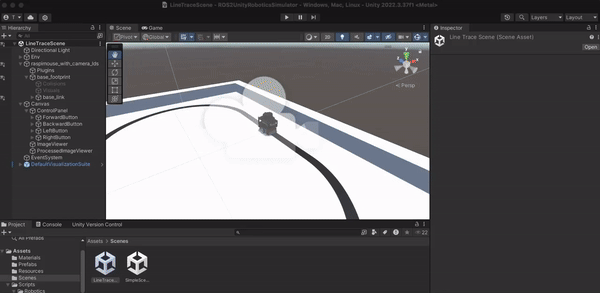

# Line Trace
## Start line trace in Docker container
- In a terminal on yout host OS, run the following if not running ros2 docker container.
    ```shell
    docker run --rm -p 10000:10000 -v $HOME/ROS/ROS2-Unity-Robotics-Simulator/ros2_docker/colcon_ws:/home/ubuntu/colcon_ws --shm-size=512m ros2-decktop-vnc:humble
    ```

- In a web browser connect to [https://host.ros2-docker.orb.local/](https://host.ros2-docker.orb.local/) if use OrbStack.
    - Click on the bottom left system menu and select `System Tools > LXTerminal`
    - In the Terminal run:
        ```shell
        ros2 launch line_tracer line_tracer_launch.py
        ```

## Start the Unity simulation
- Open the Unity project and open LineTraceScene.unity in `Assets -> Scenes`
- Press the Play button at the top of the Editor.

